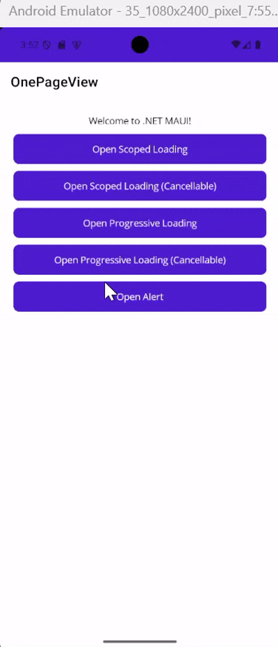
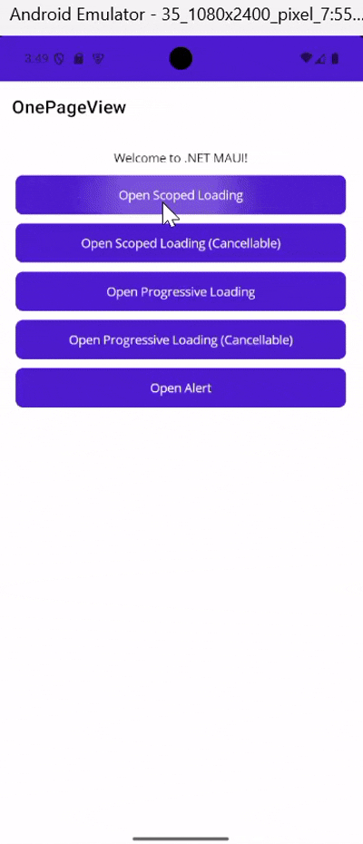
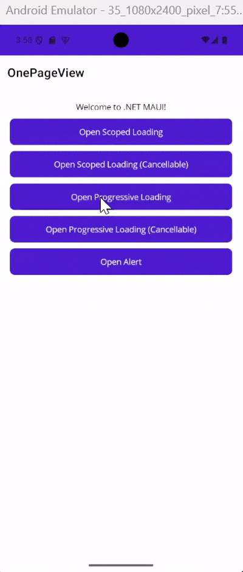

# SingleScope.Maui

[](https://www.nuget.org/packages/SingleScope.Maui/)
[](https://www.nuget.org/packages/SingleScope.Maui/)
[](LICENSE)
[](https://github.com/muhirwanto-dev/singlescope-plugins/issues)
[](https://github.com/muhirwanto-dev/singlescope-plugins/stargazers)
[](https://github.com/muhirwanto-dev/singlescope-plugins/network/members)
[](https://github.com/muhirwanto-dev/singlescope-plugins/pulls)

## 🔎 Overview

`SingleScope.Maui` is a dedicated UI utility library for .NET MAUI, providing essential custom controls and helper services to streamline app development. It focuses on simplifying common UI tasks—like dialog management and loading states—through a clean, DI-friendly (Dependency Injection) architecture.

## 🔑 Key Features

### Dialogs
`IDialogService`, A helper service that allows you to trigger system alerts and popups directly from your `ViewModel` and integrates seamlessly with your DI container, removing the need for View-specific logic for simple user notifications.



### Loading Popups
`ILoadingService`, Built-in loading controls designed to handle "waiting" states during long-running processes. These can be easily toggled to provide a smooth, professional user experience while your app processes data.

#### Loading


#### Progressive Loading


## 🛠️ Installation

Install the abstractions package via NuGet:

**Package Manager Console:**

```powershell
Install-Package SingleScope.Maui
```

**.NET CLI**
```bash
dotnet add package SingleScope.Maui
```

## 🚀 Getting Started

**Configure Dependency Injection**

```csharp
// MauiProgram.cs
builder
    .UseMauiApp<App>()
    .UseSingleScopeMaui();
```

**Dialogs**

```csharp
await _dialogService.ShowAsync(Dialog.Alert("Dialog title", "The message: lorem ipsum dolor sir amet", cancel: "Close"));

await _dialogService.ShowAsync(Alert.Info(AppStrings.SignInPage_Msg_EmailNotConfirmed));

```

**Loadings**

```csharp
// default minimum loading time: 100 ms
// loading disappear at the end of the scope
await using var _ = _loadingService.ShowAsync("scoped loading");

// minimum loading time: 3000 ms
await using var _ = _loadingService.ShowAsync(3000, "scoped loading");

// can be cancelled by tapping outside
await using var _ = _loadingService.ShowAsync("scoped loading cancelable", cancelAction: () => { });

// progressive loading has the same behavior
await using var loading = _progressiveLoading.ShowAsync("progressive loading");

// update the progress
loading.Context.UpdateProgress(progress);
```

## Contributions

Contributions are welcome! If you encounter a bug, have a suggestion, or want to contribute code, please follow these steps:

1.  Check the [GitHub Issues](https://github.com/muhirwanto-dev/singlescope-plugins/issues) to see if your issue or idea has already been reported.
2.  If not, open a new issue to describe the bug or feature request.
3.  **For code contributions:**
    * Fork the Project repository.
    * Create your Feature Branch (`git checkout -b feature/YourAmazingFeature`).
    * Commit your Changes (`git commit -m 'Add YourAmazingFeature'`). Adhere to conventional commit messages if possible.
    * Push to the Branch (`git push origin feature/YourAmazingFeature`).
    * Open a Pull Request against the `main` branch of the original repository.
4.  Please try to follow the existing coding style and include unit tests for new or modified functionality.

## License

Distributed under the [MIT License](https://github.com/muhirwanto-dev/singlescope-plugins/tree/main?tab=MIT-1-ov-file#readme). See the `LICENSE` file in the repository for more information.

## Contact

[@muhirwanto-dev](https://github.com/muhirwanto-dev)

Project link: [https://github.com/muhirwanto-dev/singlescope-plugins/tree/main/source/SingleScope.Maui](https://github.com/muhirwanto-dev/singlescope-plugins/tree/main/source/SingleScope.Maui)
